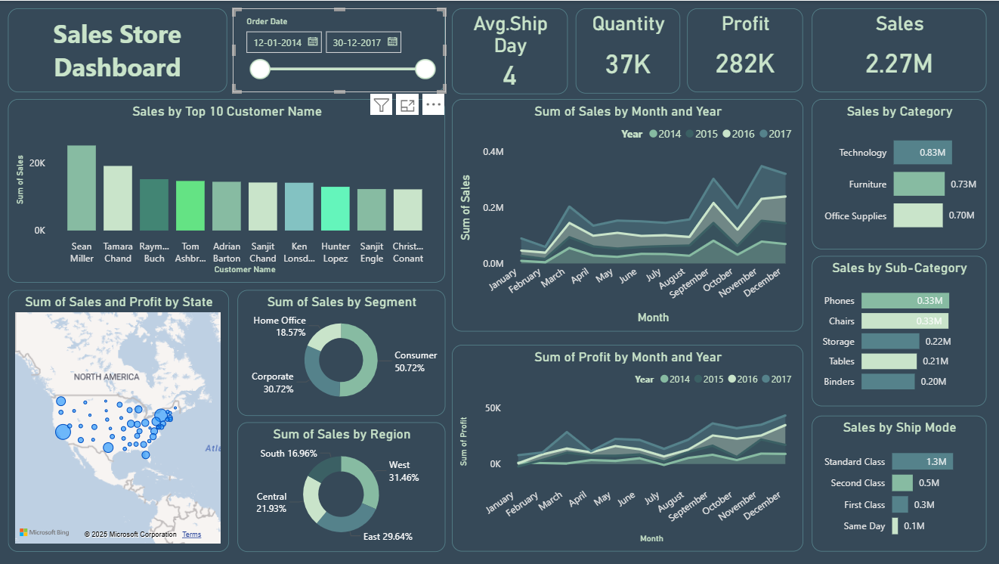

# 📊 Sales Store Dashboard

## 📌 Project Overview
This project is a **Sales Analytics Dashboard** built using **Python**, **SQL**, and **Power BI**.  
It helps track key business metrics such as **sales**, **profit**, **top customers**, and **product performance**, with **interactive visualizations** to understand trends by **region**, **category**, and **customer segment**.

---

## 🛠️ Tools & Technologies
- **Python** – For data cleaning and preparation  
- **SQL** – For querying and organizing sales data  
- **Power BI** – For creating interactive dashboards and reports  

---

## 📊 Features
- 📈 **Total Sales and Profit tracking**  
- 🏆 **Top 10 customers by sales**  
- 📦 **Sales breakdown by category, sub-category, and region**  
- 📅 **Monthly and yearly sales trends**  
- 🎯 **Interactive filters and drill-throughs**  
- ⚡ **KPI cards for quick insights**  

---

## 📂 Project Workflow
1. **Data Extraction** – Retrieved sales data from SQL database  
2. **Data Cleaning** – Used Python (**Pandas**, **NumPy**) to handle missing values, format dates, and prepare data  
3. **Data Visualization** – Built a Power BI dashboard with charts, KPIs, and filters  

---

## 📸 Dashboard Preview
  
*(Replace `images/dashboard.png` with the correct path to your screenshot in the repo)*

---

## 📈 How to Use
1. Open the **Power BI file** (`.pbix`) to view the dashboard  
2. Use **filters** to explore sales data by time, region, category, or customer segment  
3. Analyze **KPIs** to make informed business decisions  

---

## 📬 Contact
📧 Email: [youremail@example.com](mailto:karmveergurjar01@gmail.com)  
💼 LinkedIn: [Your LinkedIn Profile]([www.linkedin.com/in/karmveer-gurjar01](https://www.linkedin.com/in/karmveer-gurjar01/))  
